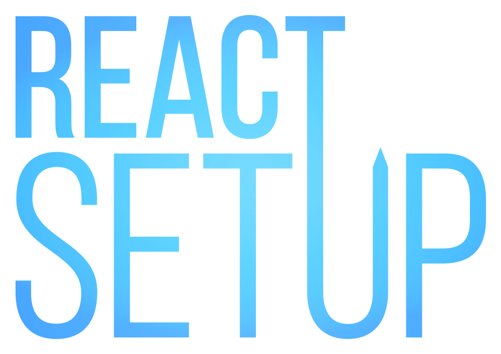

<h1>
  <div align="center">
    <a href="https://github.com/bisubus/react-setup"></a>
  </div>
  <div align="center">
    <sup><sub><b><i>It's a Setup. For Hooks.</i></b></sub></sup>
  </div>
</h1>

React Setup is a collection of hooks and helpers for better DX and component declaration with explicit setup and render phases.

Overreacting? Tired of jumping through hooks? The library provides instant relief even from severe hook fatigue. This can be considered a lesson in component design learned by React from Vue, Solid, Svelte and other modern frameworks.

## Description

Code is worth a thousand words.

### 💤 Before

```jsx
const Heroes = props => {
  const prepareWorldPromise = useWorld(); 
  use(prepareWorldPromise);

  const villains = use(VillainsContext);
  
  const [heroes, setHeroes] = useState();

  const victims = useMemo(() => calculatePossibleVictims(villains), []); // 😐
  const goVillains = useCallback(() => villains.conspire(), []); // 😕

  const gadgets = useRef();

  useEffect(() => {
    gadgets.current = wearGadgets();
    return () => removeGadgets();
  }, []);

  useEffect(() => {
    (async () => {
      const newHero = await getHero(props.newId, heroes?.missing);
      setHeroes(heroes => ([...heroes, newHero])); // 🥱

      if (noSuper(heroes)) {
        const newHero = await getSuperHero(gadgets.current);
        setHeroes(heroes => [...heroes, newHero]); // 😴
      }
    })(); // 😣
  }, [props.newId, heroes]); // 😓

  const disastersPromise = useMemo(() => villains.getDisasters(), []); // 😟
  const [disasters, setDisasters] = useState();

  useEffect(() => {
    (async () => {
      setDisasters(await disastersPromise); // 😒
    })(); // 🤢
  }, [disastersPromise]);    

  return (
    // 😬
    {disasters && <>
      <WorldDisasters value={disasters}/>
      <VictimsContext value={victims}>
        <HeroRoster />
        <HeroSaloon onBragging={goVillains} />
      </VictimsContext>
    </>}
  );
}
```

### 🚀 After

```jsx
const Heroes = setupComponent(async props => { // Props object is a stable readonly proxy
  const prepareWorldPromise = setupHook(useWorld); // Custom hooks are wrapped with setupHook
  setupPromise(prepareWorldPromise); // Uses use() inside and still needs a stable promise 

  const villains = setupContext(VillainsContext); // A ref to current context value
  
  const heroes = setupStateRef(); // Reactive writable ref that wraps useState
 
  const victims = calculatePossibleVictims(unref(villains)); // Just a constant
  const goVillains = () => unref(villains).conspire(); // Stable callback reference

  let gadgets; // No ref is needed to store a value

  setupOnMounted(() => { // Triggered at the first effect run
    gadgets = wearGadgets(); // Side effects still go to the hooks, not setup
  });

  setupOnUnmounted(() => removeGadgets()); // A cleanup paired with mounted hook 

  setupEffect(async () => { // No AIIFE, can return a promise if no cleanup
    const newHero = await getHero(props.newId, unref(heroes)?.missing); // Omit .current
    heroes.current = heroes => [...heroes, newHero]; // Supports a setter but doesn't need it

    if (noSuper(unref(heroes))) {
      const newHero = await getSuperHero(gadgets);
      heroes.current = [...unref(heroes), newHero]; // No setter, a ref keeps fresh state
    }
  }, [() => props.newId]); // No need for heroes, deps are refs or getter functions

  const disasters = await unref(villains).getDisasters(); // Stable promise with no effort

  return () => ( // Called inside suspense boundary, has access to setup context above
    // Any react hooks are still allowed here, but rarely ever needed
    <> 
      <WorldDisasters value={disasters}/>
      <VictimsContext value={victims}>
        <HeroRoster />
        <HeroSaloon onBragging={goVillains} />
      </VictimsContext>
    </>
  );
});
```
### Motivation

React class components use a constructor and `this` context to represent an instance, but their lifecycles can't pause for async operations, making them limited and counterintuitive in some applications. Functional components sidelined them to introduce concurrent mode and hook-based API, yet they trade explicit instances for hidden, renderer-managed state. This form of encapsulation can be perceived as magical and requires designing a component in a restricted way by forcing it to obey the rules of hooks.

Because a functional component is just a render function, there's no clear boundary between allocating an instance and producing UI. Everything happens at render time, so holding mutable state or using `async/await` for control flow during initialization becomes a less straightforward task. This omission complicates patterns like imperative APIs or async bootstrapping and results in less than perfect DX.

The library's goal is to reintroduce instance-like semantics to functional components while not interfering with the normal work of React hooks and renderer. It draws on other frameworks to solve similar problems and enables the declaration of a distinct setup phase while keeping the render function signature familiar.

### Highlights

- No stale values or dependency hell when using effects, props and states together
- No `useCallback`/`useMemo`/`useRef` workarounds for constants
- Brings lifecycle separation back to React components, no DSLs or other compile-time magic tricks
- Blocks rendering with suspense and `async/await`
- Works seamlessly with React hooks
- Thoroughly supports TypeScript
- ~~The logo that just *nails* it and gets you *hooked*~~

### Prior Art

- Vue `setup` (blocks with `async/await`)
- Stencil lifecycle methods (blocks with `async/await`)
- Svelte `script` (blocks with `#await`)
- Solid component function (blocks with `createResource`)
- Qwik `useTask$` (blocks with `async/await`)
- Astro frontmatter (blocks with top-level `await`)
- React own RSC (blocks with `async/await`) 

## Usage

### Installation

```sh
npm install @react-setup/core @react-setup/hooks
```

### Example

```jsx
import { setupComponent, setupEffect, unref } from '@react-setup/core';
import { setupStateRef } from '@react-setup/hooks';

export default setupComponent(function Count(props) {
  const count = setupStateRef(0);
  
  setupEffect(() => {
    const id = setInterval(() => count.current++, props.interval);
    return () => clearInterval(id);
  }, [() => props.interval]);
  
  return () => <p>{unref(count)}</p>;
});
```

## How It Works

### `setupComponent` Helper

`setupComponent` is a small convenience helper with clear semantics that wraps a component and separates it into setup and render phases. `props` parameter is replaced with a readonly proxy over the original object and a reference to which remains constant throughout the component's lifespan.

The setup phase is executed once before mounting a component and allows providing a perceived persistent instance of a component to a render function. It can optionally be `async` to make use of React suspense. All React hooks are wrapped in a way that allows them to be queued and executed on every render to not break the rules of hooks.

The render phase is a pure function that returns JSX to be rendered on every component render. Since it's defined in the scope of the setup function, it has access to the setup context. It can also become stateful and use React hooks as usual, but this defeats the purpose of the setup phase and breaks the separation of concerns.

The setup block has limitations and needs to be structured in a certain order to avoid problems to the component lifecycle:

- **Promise setup hooks**. The use of `use()` hook to unwrap promise value results in creating a new component instance and discarding the work of other hooks, so the promises must be stable
- **Other setup hooks and variables**. Any side effect-free logic and variables that may or may not use setup hooks defined in no specific order
- (Optional) **Awaited promises**. Any promise values to be resolved before they are used in a render function. Setup hooks cannot be called after the first `await` to not break the rules of hooks. A reliable cleanup is impossible for setup body, any side effects that require it should go to the effects.
- **Render function**
  - (Optional) **React hooks**. Any hooks that are called on each render, though setup hooks are meant entirely replace them. `use()` can be used instead of `await` to resolve the promises from the setup block.
  - **JSX**. The elements returned from a component

### Asynchronous Setup

Setup function can return a promise of render function or a render function can call `use()` inside to unwrap the promises from setup scope. This requires wrapping a render function internally with nested `Render` component and `Suspense` boundary to work with React suspense.

Component with asynchronous setup:

```jsx
const UserProfile = setupComponent(async props => {
  // 1. Promise setup hooks
  const users = setupPromise(usersService.usersPromise);

  // 2. Other setup hooks and variables
  const companyInfoRef = setupContext(CompanyInfoContext);

  const currentUserRef = setupMemo(() => users.find(user => user.id === props.id), [() => props.id]);

  const [detailsRef, setDetails] = setupState();

  setupEffect(async () => {
    const details = await usersService.getDetails(props.id)
    setDetails(details);
  }, [() => props.id]);

  console.log('Logged on instantiation');
  const totalMessage = translate('Total');

  // 3. Awaited promises
  const usersStats = await usersService.getStats();

  // 4. Render function
  return () => (
    <div>
      <Profile data={unref(currentUserRef)} logo={unref(companyInfoRef).logo} />
      <ProfileDetails data={unref(detailsRef)} />
      <p>${totalMessage}: {usersStats.count}</p>
    </div>
  );
});
```

Roughly desugared to functional component:

```jsx
const UserProfile = props => {
  // 1. Promise setup hooks
  const users = use(usersService.usersPromise);

  // 2. Other setup hooks and variables
  const companyInfoRef = useRef();
  companyInfoRef.current = use(CompanyInfoContext);

  const currentUserRef = useRef();
  currentUserRef.current = useMemo(() => users.find(user => user.id === props.id), [props.id]);

  const detailsRef = useRef();
  const [details, setDetails] = useState();
  currentUserRef.current = details;

  useEffect(() => {
    (async () => {
      const details = await usersService.getDetails(props.id)
      setDetails(details);
    })();
  }, [props.id]);

  const instanceRef = useRef();
  instanceRef.current = instanceRef.current ?? (() => {
    console.log('Logged on instantiation');
    const totalMessage = translate('Total');
    return { totalMessage };
  })();

  // 3. Awaited promises
  const instancePromiseRef = useRef();
  instancePromiseRef.current = instancePromiseRef.current ?? (async () => {
    const usersStats = await usersService.getStats();
    return { usersStats };
  })();

  // 4. Render function
  const UserProfileRender = useCallback(() => {
    const { totalMessage } = instanceRef.current;
    const { usersStats } = use(instancePromiseRef.current);

    return (
      <div>
        <Profile data={currentUserRef.current} logo={companyInfoRef.current.logo} />
        <ProfileDetails data={detailsRef.current} />
        <p>${totalMessage}: {usersStats.count}</p>
      </div>
    );
  }, []);

  return (
    <Suspense>
      <UserProfileRender {...props} />
    </Suspense>
  );
};
```

### Synchronous Setup

Without suspense, there is no need for additional `Render` component. Elements from a render function are returned as is.

Component with synchronous setup:

```jsx
const UserProfile = setupComponent(props => {
  // 1. Promise setup hooks
  const users = setupPromise(usersService.usersPromise);

  // 2. Other setup hooks and variables
  const companyInfoRef = setupContext(CompanyInfoContext);

  const currentUserRef = setupMemo(() => users.find(user => user.id === props.id), [() => props.id]);

  const [detailsRef, setDetails] = setupState();

  setupEffect(async () => {
    const details = await usersService.getDetails(props.id)
    setDetails(details);
  }, [() => props.id]);

  console.log('Logged on instantiation');
  const totalMessage = translate('Total');

  // 3. Render function
  return () => <div>...</div>;
});
```

Roughly desugared to functional component:

```jsx
const UserProfile = props => {
  // 1. Promise setup hooks
  // ...

  // 2. Other setup hooks and variables
  // ...

  const instanceRef = useRef();
  instanceRef.current = instanceRef.current ?? (() => {
    console.log('Logged on instantiation');
    const totalMessage = translate('Total');
    return { totalMessage };
  })();

  // 3. Render function
  const { totalMessage } = instanceRef.current;

  return <div>...</div>;
};
```

### `useSetup` and `useConstProps` Hooks

These React hooks offer less obtrusive alternative to `setupComponent` and are usable without changing component declaration. `useSetup` can serve as gradual transition to `setupComponent` definitions or on its own to define perceived component instance on first render, e.g., for the use with `useImperativeHandle`. `useConstProps` returns a stable reference to original props object for use inside `useSetup`, a readonly proxy preventing accidental mutation.

Due to natural limitations that `setupComponent` doesn't have, `useSetup` must return all values used outside it. It's also not intended for asynchronous setup that uses `async/await` and returns a promise.

It doesn't serve a good purpose to move `use()` or other hooks that return stable values inside `useSetup`. If a context isn't expected to change through the component lifetime, `use(Context)` can stay outside `useSetup`.

Component with `useSetup`:

```jsx
const UserProfile = propsArg => {
  const users = use(usersService.usersPromise);
  const companyInfo = use(CompanyInfoContext);

  const props = useConstProps(propsArg);
  
  const { detailsRef, totalMessage } = useSetup(() => {
    const [detailsRef, setDetails] = setupState();

    setupEffect(async () => {
      const details = await usersService.getDetails(props.id)
      setDetails(details);
    }, [() => props.id]);
    
    console.log('Logged on instantiation');
    const totalMessage = translate('Total');
    
    return { detailsRef, totalMessage };
  });
  
  return <div>...</div>;
};
```

Roughly desugared to the component:

```jsx
const UserProfile = props => {
  const users = use(usersService.usersPromise);
  const companyInfo = use(CompanyInfoContext);

  const detailsRef = useRef();
  const [details, setDetails] = useState();
  currentUserRef.current = details;

  useEffect(() => {
    (async () => {
      const details = await usersService.getDetails(props.id)
      setDetails(details);
    })();
  }, [props.id]);
  
  const instanceRef = useRef();
  instanceRef.current = instanceRef.current ?? (() => {
    console.log('Logged on instantiation');
    const totalMessage = translate('Total');
    return { totalMessage };
  })();
  
  const { totalMessage } = instanceRef.current;
  
  return <div>...</div>;
};
```

### `setupHook` and `setupRefHook` Helpers

They can wrap React hooks for use inside `setupComponent` or `useSetup`. They queue callback arguments to run on each render in the same order to follow the rules of hooks. `setupHook` returns constant value from the first call of a callback as is. `setupRefHook` prewraps callback result with a ref that can change on component updates.

All setup hooks from core package are React hooks wrapped with `setupHook` and `setupRefHook`, with parameters and return values adapted to the setup phase.

## API

### `@react-setup/core`

Built-in React hooks and their setup hook counterparts:

| React hook             | Setup hook                    |
|------------------------|-------------------------------|
| `use`                  | `setupPromise`, `setupContext` |
| `useActionState`       | `setupActionState`            |
| `useCallback`          | ✖ Not needed                  |
| `useContext`           | `setupContext`                |
| `useDebugValue`        | `setupDebugValue`             |
| `useDeferredValue`     | `setupDeferredValue`          |
| `useEffect`            | `setupEffect`                 |
| `useEffectEvent`       | ✖ Not needed                  |
| `useFormStatus`        | `setupFormStatus`             |
| `useId`                | `setupId`                     |
| `useImperativeHandle`  | `setupImperativeHandle`       |
| `useInsertionEffect`   | `setupInsertionEffect`        |
| `useLayoutEffect`      | `setupLayoutEffect`           |
| `useMemo`              | `setupMemo`                   |
| `useOptimistic`        | `setupOptimistic`             |
| `useReducer`           | `setupReducer`                |
| `useRef`               | `setupRef`                    |
| `useState`             | `setupState`                  |
| `useSyncExternalStore` | `setupSyncExternalStore`      |
| `useTransition`        | `setupTransition`             |

Setup helpers:

- `setupComponent`
- `setupHook`
- `setupRefHook`

Utility functions:

- `createObjProxy`
- `createRefLike`
- `isRef`
- `unref`

Utility types:

- `TMaybeRef`
- `TReadonlyRef`
- `TRef`

### `@react-setup/hooks`

Additional React hooks and their setup hook counterparts:

| React hook                | Setup hook                    |
|---------------------------|-------------------------------|
| `useAsyncEffect`          | `setupEffect` (core)          |
| `useAsyncInsertionEffect` | `setupInsertionEffect` (core) |
| `useAsyncLayoutEffect`    | `setupLayoutEffect` (core)    |
| `useConst`                | ✖ Not needed                  |
| `useConstProps`           | ✖ Not needed                  |
| `useOnMount`              | `setupOnMount`                |
| `useOnMounted`            | `setupOnMounted`              |
| `useOnUnmounted`          | `setupOnUnmounted`            |
| `usePromise`              | `setupPromise` (core)         |
| `useRefFromState`         | ✖ Not needed                  |
| `useSetup`                | ✖ Not needed                  |
| `useStateRef`             | `setupStateRef`               |
| `useSyncRef`              | ✖ Not needed                  |

---

## Contributing

Contributions are welcome. Feel free to open issues or submit pull requests.

---

## License

MIT
